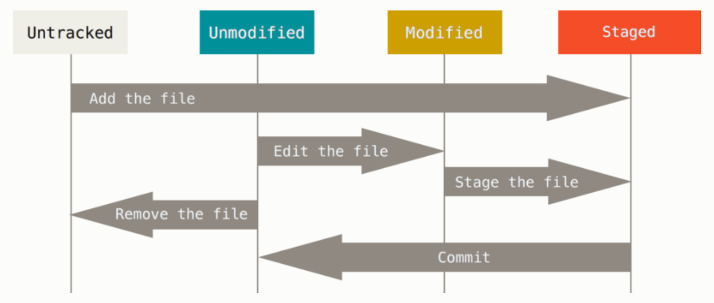

### <font color=red>记录每次更新到仓库</font>

现在我们机器上有了一个**真实项目**的Git仓库，并从这个仓库中检出了所有文件的**工作副本**。通常，你会对这些文件做些修改，每当完成了一个阶段的目标，想要记录下它时，就将它提交到仓库。

工作目录下的每一个文件都不外乎两种状态：**已跟踪** 或 **未跟踪**。

已跟踪的文件指的是那些被纳入版本控制的文件，再上一次快照中有它们的记录。再工作一段时间后，它们的状态可能是未修改、已修改或已放入暂存区。

简而言之，已跟踪的文件就是Git已经知道的文件，除此之外都是未跟踪文件，既不存在于上次的快照的记录中也没有被放入暂存区。初次克隆某个仓库的时候，工作目录中的所有文件都属于已跟踪文件，并处于未修改状态，因为Git刚刚检出了它们，而你尚未编辑过它们。

编辑过某些文件之后，由于自上次提交后你对它们做了修改，Git将它们标记为已修改文件。在工作时，你可以选择性地将这些修改过的文件放入暂存区，然后提交所有已暂存的修改，如此反复。



#### 检查当前文件状态
可以用 ```git status``` 命令查看那些文件处于什么状态。比如在克隆仓库后立即使用此命令：
```
$ git status
On branch master
Your branch is up-to-date with 'origin/master'
nothing to commit, working direcctory clean
```

这说明所有已跟踪的文件在上次提交后都未更改过，还表明当前目录下没有任何未跟踪文件，否则Git会在这里列出来。最后，该命令还显示了当前所在分支，并告诉你这个分支同远程服务器上对应的分支没有偏离。

#### 跟踪新文件
使用命令 ```git add``` 开始跟踪一个文件，比如 ```README``` ：
```
$ git add README
```

此时再运行 ```git status``` ，会看到 ```README``` 文件已被跟踪，并处于暂存状态：
```
$ git status
On branch master
Your branch is up=to-date with 'origin/master'.
Changes to be committed:
    (use "git restore --staged /<file>..." to unstage)

      new file:   README
```

只要在 ```Change to be committed``` 这行下面的，就说明是已暂存状态，如果此时提交，那么该文件在你运行 ```git add``` 时的版本将被留存在后续的历史记录中。```git add``` 命令使用文件或目录的路径作为参数；如果参数是目录的路径，将递归地跟踪该目录下所有文件。

#### 暂存已修改的文件
如果你修改了一个名为 ```CONTRIBUTING.md``` 的已被跟踪的文件：
```
$ git status
On branch master
Your branch is up-to-date with 'origin/master'.
Changes to be committed:
  (use "git reset HEAD <file>..." to unstage)

    new file:   README

Changes not staged for commit:
  (use "git add <file>..." to update what will be committed)
  (use "git checkout -- <file>..." to discard changes in working directory)

    modified:   CONTRIBUTING.md
```

出现在 ```Change not staged for commit``` 这行下面，说明已跟踪文件的内容发生了变化，但还没有放到暂存区。要暂存这次更新，还是运行 ```git add``` 。

这是个多功能命令：可以用它开始跟踪新文件、可以把已跟踪的文件放到暂存区、甚至能用于合并时把有冲突的文件标记为已解决状态等。将这个命令理解为“精准地将内容添加到下一次提交中”而不是“将一个文件添加到项目中”。

现在将 ```CONTRIBUTING.md```放到暂存区，再运行 ```git status``` 看看：
```
$ git add CONTRIBUTING.md
$ git status
On branch master
Your branch is up-to-date with 'origin/master'.
Changes to be committed:
  (use "git reset HEAD <file>..." to unstage)

    new file:   README
    modified:   CONTRIBUTING.md
```

现在两个文件都已暂存，下次提交时就会一并记录到仓库。

假设此时，你又想更改 ```CONTRIBUTING.md``` ,重新编辑保存后，再运行 ```git status``` 看看：
```
$ git status
On branch master
Your branch is up-to-date with 'origin/master'.
Changes to be committed:
  (use "git reset HEAD <file>..." to unstage)

    new file:   README
    modified:   CONTRIBUTING.md

Changes not staged for commit:
  (use "git add <file>..." to update what will be committed)
  (use "git checkout -- <file>..." to discard changes in working directory)

    modified:   CONTRIBUTING.md
```
现在 ```CONTRIBUTING.md``` 同时出现在暂存区和非暂存区。因为Git只不过暂存了运行 ```git add```时刻的版本。如果你现在提交，提交的是上次 ```git add``` 时的版本，而不是你现在工作目录中的版本。所以，运行了 ```git add``` 之后又作修订的文件，需要重新 ```git add```，把最新版本暂存起来：
```
$ git add CONTRIBUTING.md
$ git status
On branch master
Your branch is up-to-date with 'origin/master'.
Changes to be committed:
  (use "git reset HEAD <file>..." to unstage)

    new file:   README
    modified:   CONTRIBUTING.md
```


#### 状态简览
使用 ```git status -s``` 或 ```git status --short``` 命令可以得到一种更为紧凑的格式输出。
```
$ git status -s
 M README
MM Rakefile
A  lib/git.rb
M  lib/simplegit.rb
?? LICENSE.txt
```
五种标志分别对应的状态：
* ?  ? ：未跟踪文件
* A&nbsp;&nbsp;&nbsp; ：新添加到暂存区的文件
* &nbsp;&nbsp;&nbsp;M：被修改了但是还没放入暂存区
* M&nbsp;&nbsp;&nbsp;：修改过并放入暂存区的文件
* MM：被修改了，放入暂存区后又被修改了


#### 查看已暂存和未暂存的修改
如果 ```git status``` 命令的输出对你来说过于模糊，你想知道具体修改了什么地方，可以用 ```git diff``` 命令，它将通过文件补丁的格式显示具体哪些行发生了改变。

假如再次修改 ```README``` 文件后暂存，编辑 ```CONTRIBUTING.md``` 文件但未暂存，运行 ```git diff``` ：
```

  $ git diff
  diff --git a/CONTRIBUTING.md b/CONTRIBUTING.md
  index 8ebb991..643e24f 100644
  --- a/CONTRIBUTING.md
  +++ b/CONTRIBUTING.md
  @@ -65,7 +65,8 @@ branch directly, things can get messy.
   Please include a nice description of your changes when you submit your PR;
   if we have to read the whole diff to figure out why you're contributing in the first place, you're less likely to get feedback and have your change merged in. Also, split your changes into comprehensive chunks if your patch is longer than a dozen lines.
   If you are starting to work on a particular area, feel free to submit a PR that highlights your work in progress (and note in the PR title that it's not ready to merge) and we can help get it ready for merging.
```
此命令比较的是工作目录中当前文件和暂存区快找之间的差异，也就是修改后还没暂存的变化内容。

如果要查看已暂存的将要添加到下次提交里的内容，可以使用```git diff --cached``` 或者 ```git diff --staged  ``` 命令。
```
$ git diff --staged
  diff --git a/README b/README
  new file mode 100644
  index 0000000..03902a1
  --- /dev/null
  +++ b/README
  @@ -0,0 +1 @@
  +My Project
```

注意，```git diff``` 本身只显示尚未暂存的改动，而不是自上次提交以来所做的所有改动。所以，如果你已经暂存了所有更新过的文件，运行 ```git diff``` 就会看不到任何输出。

#### 提交更新
现在的暂存区已经准备妥当可以提交了。每次提交前，都用 ```git status``` 看下，想提交的更新是不是都已暂存起来了，然后再运行提交命令 ```git commit``` 。不加参数直接运行会启动文本编辑器以输入本次提交的说明。

也可以在```git commit``` 后面加上 ```-m``` 参数，将提交信息与命令放在同一行：
```
  $ git commit -m "Story 182: Fix benchmarks for speed"
  [master 463dc4f] Story 182: Fix benchmarks for speed
   2 files changed, 2 insertions(+)
   create mode 100644 README
```

提交后它会告诉你，当前是在哪个分支（master）提交的，本次提交的完整SHA-1校验和是什么（463dc4f），以及在本次提交中有多少文件修订过，多少行增删改了。

请记住，提交时记录的事放在暂存区域的快找。每一次运行提交操作，都是对你项目作的一次快照片，以后可以回到这个状态，或者进行比较。

#### 跳过使用暂存区域
尽管使用暂存区的方式可以精心准备要提交的细节，但有时候这么做略显繁琐。Git提供了一个跳过使用暂存区的方式，只要在提交的时候，给 ```git commit``` 加上 ```-a``` 选项，Git就会自动把所有已经跟踪过的文件暂存起来一并提交，从而跳过 ```git add``` 步骤


#### 移除文件
要从Git中移除某个文件，就必须要从已跟踪文件清单中移除（确切地说，是从暂存区域移除），然后提交。可以用 ```git rm``` 命令完成此项工作，并连带从工作目录中删除指定的文件，这样以后就不会出现在未跟踪文件列表中。

如果只是简单地从工作目录中手工删除文件，运行 ```git status``` 时就会在 “Changes not staged for commit” 部分（也就是未暂存清单）看到。

另一种情况是，我们想把文件从Git仓库中删除，但仍然希望保留在当前工作目录，也就是单纯希望Git不再跟踪，可以使用 ```git rm --cached``` 命令，仅在暂存区域删除文件，而保留在当前工作目录中。

```git rm``` 命令后面可以列出文件或目录的名字，也可以使用 ```glob``` 模式。


#### 移动文件
要在Git中对文件改命，可以这么做：
```
git mv file_from file_to
```
此时查看状态信息，也会明白无误地看到关于重命名操作的说明：
```
  $ git mv README.md README
  $ git status
  On branch master
  Changes to be committed:
    (use "git reset HEAD <file>..." to unstage)
      renamed:    README.md -> README
```

这等同于运行：
```
$ mv README.md README
$ git rm README.md
$ git add README
```
如此分开操作，Git 也会意识到这是一次改名，所以不管何种方式结果都一样。

### 查看提交历史
当你想回顾下提交历史，可以使用 ```git log``` 命令。

默认不加参数的话，```git log``` 会按提交时间列出所有的更新，最近的更新排在最上面。每次提交都会列出提交的 SHA-1 校验和、作者的名字和电子邮件地址、提交时间以及提交说明。

```git log``` 有许多选项可以帮助搜寻你要找的提交。

一个常用的是 ```-p``` ，用来显示每次提交的内容差异。你也可以加上 ```-2``` 来仅显示最近的两次提交。该选项除了显示基本信息之外，还在附带了每次 commit 的变化。当进行代码审查，或者快速浏览某个搭档提交 的commit所带来的变化的时候，这个参数就非常有用了。

你也可以为 ```git log``` 附带一系列的总结性选项。

比如说，如果你想看到每次提交的简略统计信息，可以使用```--stat``` 选项，在每次提交的下面列出所有被修改过的文件、有多少文件被修改了以及被修改的文件的哪些行被增删改了。在每次提交的最后还有一个总结。

另外一个常用选项是 ```--pretty``` ，可以使用不同于默认格式的方式展示提交历史。比如 ```oneline``` 选项，每个提交显示在一行，查看的提交数很大时非常有用。另外还有 ```short``` 、 ```full``` 和 ```fuller``` ，以及 ```format``` 选项可以定制你的提交历史输出。

当 online 或 format与 ```--graph``` 选项结合时，尤其有用。这个选项添加了一些ASCII字符串来形象地展示你的分支、合并历史。

#### 限制输出长度
···

### 撤销操作
在任何一个阶段，你都可能想撤销某些操作，这里我们将学习几个撤销你所做修改的基本工具。注意，有些撤销是不可逆的，这是在使用Git过程中少有的几个会因为操作失误导致之前的工作丢失的地方之一。

有时候我们提交完了才发现漏掉几个文件没有添加，或者提交信息写错了。此时，可以运行 ```git commit --amend``` 命令，最终你只会有一次提交，第二次提交将取代第一次提交的结果。

#### 取消暂存的文件
当需要取消暂存文件时，可以使用 ```git reset HEAD <file>``` 命令。这个命令既可以用于取消暂存目录下的文件，也可以用于取消暂存的文件。

#### 撤销对文件的修改
如果你不想保留对某个文件的更改，将它还原成上次提交时的样子，可以使用 ```git checkout -- <file>``` 命令。


### 远程仓库的使用

