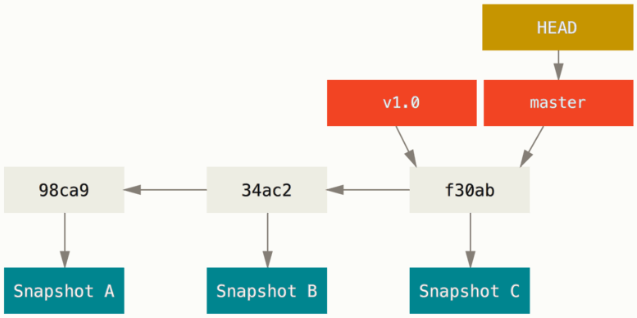
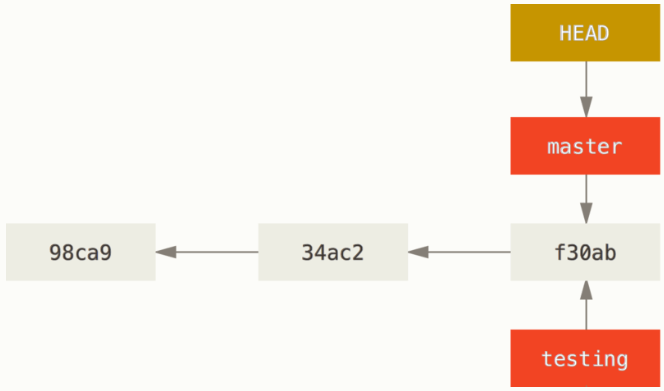
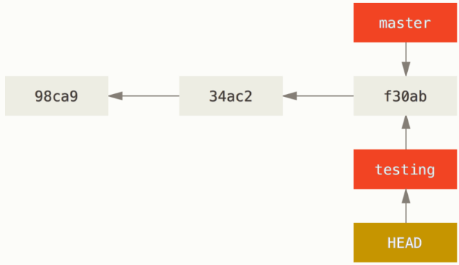
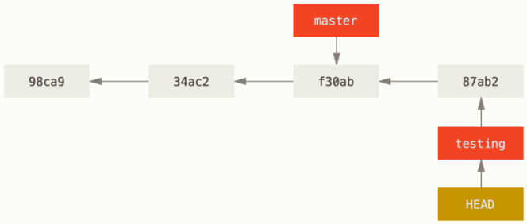
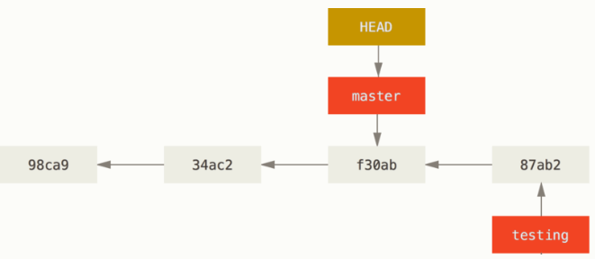
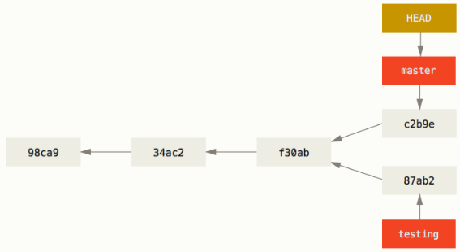

有人把Git的分支模型成为它的“必杀技特性”，也正是因为这一特性，使得Git从众多版本控制系统中脱颖而出。

### <font color=red>分支简介</font>

Git保存的不是文件的变化或者差异，而是一系列不同时刻的**快照**。

在进行提交操作时，Git会保存一个提交对象，包含一个指向暂存内容快照的指针，还包括了作者的姓名和邮箱、提交信息以及指向父对象的指针。首次提交产生的对象没有父对象，普通提交产生的对象有一个父对象，而由多个分支合并产生的提交对象有多个父对象。

Git的分支，其实本质上仅仅是指向提交对象的可变指针。Git的默认分支是 ```main```，在多次提交操作之后，你其实已经有一个指向最后那个提交对象的```main```分支，它会在每次提交时自动向前移动。

**假设现在你已经提交了三次**：


#### 分支创建
Git创建新分支时，只是为你创建了一个可移动的新的指针。比如创建一个 testing 分支，你只需要使用 ```git branch``` 命令：
```
git branch testing
```
**这会在当前所在的提交对象上创建一个新指针。**


Git有一个名为 ```HEAD``` 的特殊指针，它指向当前所在分支。目前你仍然在 ```master``` 分支上，因为 ```git branch``` 命令仅仅**创建**一个新分支，并不会自动切换过去。


#### 分支切换
要切换到一个已存在的分支，你需要使用 ```git checkout``` 命令。比如要切换到 ```testing``` 分支：
```
git checkout testing
```

**这样，```HEAD``` 指针就指向了 ```testing``` 分支。**



#### 在分支提交

那么，这样的实现方式会给我们带来什么好处呢？现在不妨再提交一次：
```
vim test.rb
git commit -a -m "made a change"
```


这样，```testing``` 分支的指针向前移动，但 ```master``` 分支的指针仍然停留在之前的提交对象上。这就是Git的分支模型，它的分支实际上仅仅是移动指针。

现在，我们切换回 ```master``` 分支看看：
```
git checkout master
```

这条命令做了两件事，一是使 HEAD 指回 ```master``` 分支，二是将工作目录回复成 ```master``` 分支所指向的快找内容。


我们不妨再稍微做些修改并提交：
```
vim test.rb
git commit -a -m "made other changes"
```

现在，这个项目的提交历史已经产生了分叉。因为你刚创建了一个新分支，并切换到新分支提交，又切回master提交。上述两次改动是针对不同分支，你可以在不同分支间不断来回切换和工作，并在时机成熟时将它们合并起来。而所有这些工作，需要的命令只有 ```git branch```、```git checkout``` 和 ```git commit```。

#### 查看分支历史
你可以运行 ```git log --online --decorate --graph --all``` 查看所有分支的提交历史：
```
$ git log --oneline --decorate --graph --all
* c2b9e (HEAD, master) made other changes
| * 87ab2 (testing) made a change
|/
* f30ab add feature #32 - ability to add new formats to the
* 34ac2 fixed bug #1328 - stack overflow under certain conditions
* 98ca9 initial commit of my project
```