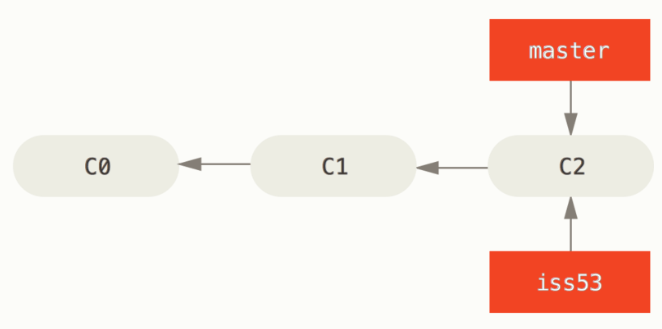
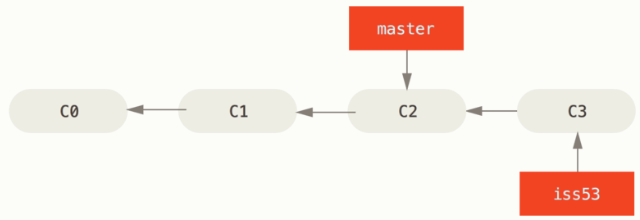
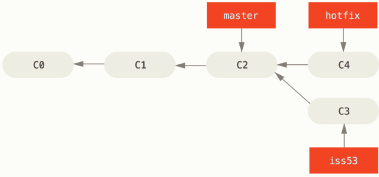
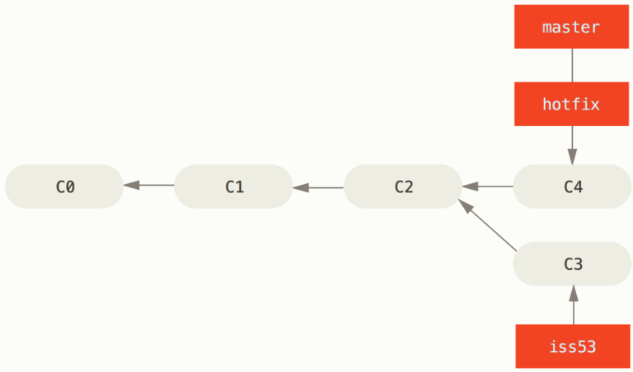
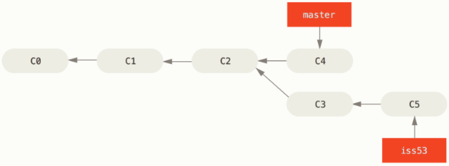
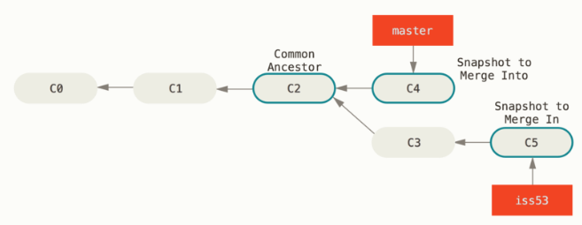

### <font color=red>分支的新建与合并</font>
让我们来看一个简单的分支新建与分支合并的例子：
1. 开发某个网站
2. 为实现某个新的用户需求，创建一个分支
3. 在这个分支上开展工作。

正在此时，你突然接到一个电话说有个很严重的问题急需修补。这时你需要：
1. 切换到你的线上分支
2. 为这个紧急任务新建一个分支，并在其中修复它。
3. 在测试通过后，切换回线上分支，然后合并这个修补分支，最后将改动推送到线上仓库。
4. 最后，你切换回你的工作分支，继续你的工作。

#### 为实现某个新需求，创建一个分支
首先，假设你正在你的项目上工作，并且在 ```msater``` 分支已经有了一些提交。现在，你决定解决 #53 问题。想新建一个分支并同时切换过去，可以运行一个带有 ```-b``` 参数的 ```git checkout``` 命令：
```
$ git checkout -b iss53
Switched to a new branch 'iss53'
```
它是下面两条命令的简写：
```
git branch iss53
git checkout iss53
```


#### 在这个分支上开展工作
你继续在 #53 问题上工作，并做了一些提交。在此过程中， ```iss53``` 分支的指针会不断向前移动，因为你已经检出到该分支。



#### 收到紧急问题，切换回线上分支
现在，你接到了那个电话，需要紧急修复线上问题。
你需要切换回 ```master``` 分支。但是，在你这么做之前，要留意你的工作目录和暂存区那些还没有被提交的更改，他可能会和你即将检出的分支产生冲突从而阻止Git切换到该分支。
现在，假设你已经把你的修改全部提交了，可以切换回 ```master``` 分支了：
```
$ git checkout master
Switched to branch 'master'
```
这个时候，你的工作目录和你在开始 #53 问题之前一摸一样，你可以专心修复紧急问题了。

#### 为紧急问题新建一个分支，并在其中修复它
我们来新建一个 ```hotfix``` 分支，在该分支上工作直到问题解决：
```
$ git checkout -b hotfix
Switched to a new branch 'hotfix'
$ vim index.html
$ git commit -a -m 'fixed the broken email address'
[hotfix 1fb7853] fixed the broken email address
 1 file changed, 2 insertions(+)
 ```


#### 测试通过后，切换回线上分支，合并修补分支，推送远程仓库
你可以运行你的测试，确保修改是正确的，然后将 ```hotfix``` 分支合并回 ```master``` 分支，可以使用 ```git merge``` 命令：
```
$ git checkout master
$ git merge hotfix
Updating f42c576..3a0874c
Fast-forward
 index.html | 2 ++
 1 file changed, 2 insertions(+)
```

当你试图合并两个分支时，如果顺着一个分支走下去能够到达另一个分支，那么Git在合并两者时，只会简单地将指针向前推进，因为这种情况下的合并操作并没有要解决的冲突-----这就叫做”快进（fast-forward）”

现在，最新的修改已经在 ```master``` 分支所指向的提交快找中，可以着手发布该修复了。


合并两个分支之后，你应该删除 ```hotfix``` 分支，因为你已经不再需要它了。你可以使用带有 ```-d``` 参数的 ```git branch``` 命令来删除它：
```
$ git branch -d hotfix
Deleted branch hotfix (was 3a0874c).
```


#### 切换回工作分支，继续工作
现在，你可以切换回 #53 问题的分支继续工作
```
$ git checkout iss53
Switched to branch "iss53"
$ vim index.html
$ git commit -a -m 'finished the new footer [issue 53]'
[iss53 ad82d7a] finished the new footer [issue 53]
1 file changed, 1 insertion(+)
```


#### #53 开发完成，合并入线上分支
现在，你的新功能已经完成，需要合并 ```iss53``` 分支到 ```master``` 分支。你只需要检出到你想合并入的分支，然后运行 ```git merge``` 命令：
```
$ git checkout master
Switched to branch 'master'
$ git merge iss53
Merge made by the 'recursive' strategy.
index.html |    1 +
1 file changed, 1 insertion(+)
```
这看起来和之前合并 ```hotfix``` 有些不一样。因为 ```master``` 分支所在的提交不是 ```iss53``` 分支所在提交的直接祖先，两个分支历史从一个更早的地方分叉开。对于这种情况，Git不得不做一些额外工作，它会使用两个分支末端所指的快照（C4 和 C5）以及这两个分支的公共祖先 （C2），做一个简单的三方合并。


和之前将分支是真向前推进不同的是，Git将此次三方合并结果做了一个新快照并自动创建一个新的提交指向它。这个被称为一个合并提交，它的特别之处在于有两个父提交。

#### 遇到冲突时的分支合并
如果你在两个不同的分支中，对同一个文件的同一个部分进行了不同的修改，Git就没法干净的合并它们。
假设你对 #53 问题的修改和有关 ```hotfix``` 分支的修改都涉及同一个文件的同一处，在合并它们时就会产生冲突：
```
$ git merge iss53
Auto-merging index.html
CONFLICT (content): Merge conflict in index.html
Automatic merge failed; fix conflicts and then commit the result.
```

此时，Git做了合并，但并没有自动创建一个合并提交，而是停下来，等待你去解决合并产生的冲突。你可以在合并冲突后任意时刻使用 ```git status``` 命令查看那些因包含合并冲突而处于未合并（unmerged）状态的文件：
```
$ git status
On branch master
You have unmerged paths.
  (fix conflicts and run "git commit")

Unmerged paths:
  (use "git add <file>..." to mark resolution)

    both modified:      index.html

no changes added to commit (use "git add" and/or "git commit -a")
```

Git会在有冲突的文件中加入标准的冲突解决标记，这样你可以打开这些包含冲突的文件然后手动解决冲突。
```
<<<<<<< HEAD:index.html
<div id="footer">contact : email.support@github.com</div>
=======
<div id="footer">
 please contact us at support@github.com
</div>
>>>>>>> iss53:index.html
```
上半部分表示当前分支所示的版本，下半部分表示要合并进来的分支所示的版本。为了解决冲突，必须选择使用哪个版本，或自行合并这些内容。

你在解决每个文件的冲突后，对每个文件使用 ```git add``` 命令来讲起标记为冲突已解决。一旦暂存这些原本有冲突的文件，Git就会将它们标记为已解决。

你可以再次运行 ```git status``` 来确认所有的冲突都已被解决：
```
git status
On branch master
All conflicts fixed but you are still merging.
  (use "git commit" to conclude merge)

Changes to be committed:

    modified:   index.html
```

如果你对结果感到满意，并且确定之前有冲突的文件都已暂存，最后输入 ```git commit``` 来完成合并提交。
