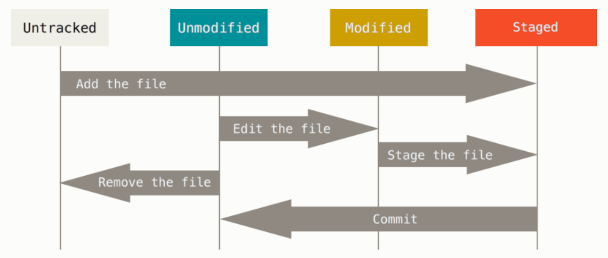

### <font color=red>记录每次更新到仓库</font>

现在我们机器上有了一个**真实项目**的Git仓库，并从这个仓库中检出了所有文件的**工作副本**。通常，你会对这些文件做些修改，每当完成了一个阶段的目标，想要记录下它时，就将它提交到仓库。

工作目录下的每一个文件都不外乎两种状态：**已跟踪** 或 **未跟踪**。

已跟踪的文件指的是那些被纳入版本控制的文件，再上一次快照中有它们的记录。再工作一段时间后，它们的状态可能是未修改、已修改或已放入暂存区。

简而言之，已跟踪的文件就是Git已经知道的文件，除此之外都是未跟踪文件，既不存在于上次的快照的记录中也没有被放入暂存区。初次克隆某个仓库的时候，工作目录中的所有文件都属于已跟踪文件，并处于未修改状态，因为Git刚刚检出了它们，而你尚未编辑过它们。

编辑过某些文件之后，由于自上次提交后你对它们做了修改，Git将它们标记为已修改文件。在工作时，你可以选择性地将这些修改过的文件放入暂存区，然后提交所有已暂存的修改，如此反复。



#### 检查当前文件状态
可以用 ```git status``` 命令查看那些文件处于什么状态。比如在克隆仓库后立即使用此命令：
```
$ git status
On branch master
Your branch is up-to-date with 'origin/master'
nothing to commit, working direcctory clean
```

这说明所有已跟踪的文件在上次提交后都未更改过，还表明当前目录下没有任何未跟踪文件，否则Git会在这里列出来。最后，该命令还显示了当前所在分支，并告诉你这个分支同远程服务器上对应的分支没有偏离。

#### 跟踪新文件
使用命令 ```git add``` 开始跟踪一个文件，比如 ```README``` ：
```
$ git add README
```

此时再运行 ```git status``` ，会看到 ```README``` 文件已被跟踪，并处于暂存状态：
```
$ git status
On branch master
Your branch is up=to-date with 'origin/master'.
Changes to be committed:
    (use "git restore --staged /<file>..." to unstage)

      new file:   README
```

只要在 ```Change to be committed``` 这样下面的，就说明是以暂存状态，如果此时提交，那么该文件在你运行 ```git add``` 时的版本将被留存在后续的历史记录中。```git add``` 命令使用文件或目录的路径作为参数，；如果参数是目录的路径，将递归地跟踪该目录下所有文件。

#### 暂存已修改的文件
如果你修改了一个名为 ```CONTRIBUTING.md``` 的已被跟踪的文件：
```
$ git status
On branch master
Your branch is up-to-date with 'origin/master'.
Changes to be committed:
  (use "git reset HEAD <file>..." to unstage)

    new file:   README

Changes not staged for commit:
  (use "git add <file>..." to update what will be committed)
  (use "git checkout -- <file>..." to discard changes in working directory)

    modified:   CONTRIBUTING.md
```

出现在 ```Change not staged for commit``` 这行下面，说明已跟踪文件的内容发生了变化，但还没有放到暂存区。要暂存这次更新，还是运行 ```git add``` 。

这是个多功能命令：可以用它开始跟踪新文件、可以把已跟踪的文件放到暂存区、甚至能用于合并时把有冲突的文件标记为已解决状态等。将这个命令理解为“精准地将内容添加到下一次提交中”而不是“将一个文件添加到项目中”。

现在将 ```CONTRIBUTING.md```放到暂存区，再运行 ```git status``` 看看：
```
$ git add CONTRIBUTING.md
$ git status
On branch master
Your branch is up-to-date with 'origin/master'.
Changes to be committed:
  (use "git reset HEAD <file>..." to unstage)

    new file:   README
    modified:   CONTRIBUTING.md
```

现在两个文件都已暂存，下次提交时就会一并记录到仓库。

假设此时，你又想更改 ```CONTRIBUTING.md``` ,重新编辑保存后，再运行 ```git status``` 看看：
```
$ git status
On branch master
Your branch is up-to-date with 'origin/master'.
Changes to be committed:
  (use "git reset HEAD <file>..." to unstage)

    new file:   README
    modified:   CONTRIBUTING.md

Changes not staged for commit:
  (use "git add <file>..." to update what will be committed)
  (use "git checkout -- <file>..." to discard changes in working directory)

    modified:   CONTRIBUTING.md
```
现在 ```CONTRIBUTING.md``` 同时出现在暂存区和非暂存区。因为Git只不过暂存了运行 ```git add```时刻的版本。如果你现在提交，提交的是上次 ```git add``` 时的版本，而不是你现在工作目录中的版本。所以，运行了 ```git add``` 之后又作修订的文件，需要重新 ```git add```，把最新版本暂存起来：
```
$ git add CONTRIBUTING.md
$ git status
On branch master
Your branch is up-to-date with 'origin/master'.
Changes to be committed:
  (use "git reset HEAD <file>..." to unstage)

    new file:   README
    modified:   CONTRIBUTING.md
```

#### 状态简览
